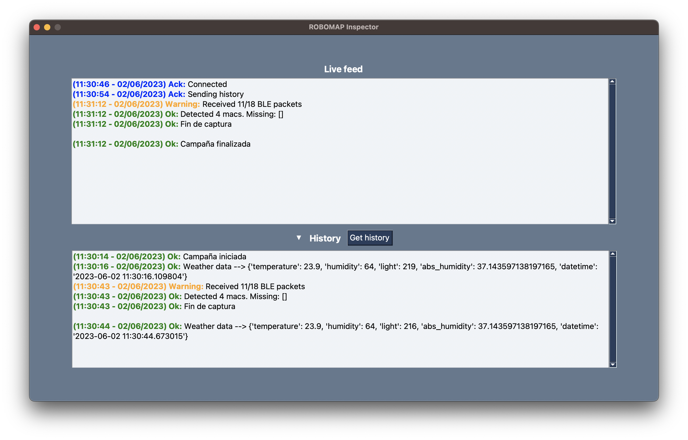
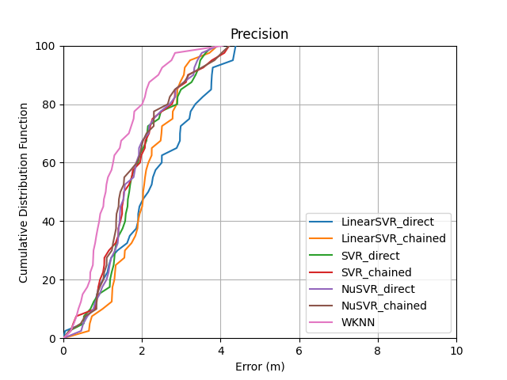

# TFG sobre Posicionamiento en Interiores

Trabajo de Fin de Grado (TFG) de Ingeniería Informática en la Universidad de Las Palmas de Gran Canaria. El objetivo general de este trabajo es contribuir en el proyecto de investigación de Sistemas de Posicionamiento en Interiores o IPS (del inglés Indoors Positioning System) del Instituto Universitario de Cibernética, Empresas y Sociedad. Se divide en tres partes:

## Autonomía
ROBOMAP es una plataforma robótica que es capaz de seguir una ruta mientras realiza la captura de señales de balizas (en inglés beacons) Bluetooth Low Energy (BLE) en un entorno de interiores. Hasta el momento funciona conectándose a una toma de corriente. Como se quiere dotar la plataforma de autonomía energética, se realiza un estudio de sus componentes y correspondiente consumo.

## Sistema de alertas
Se busca añadir la posibilidad de hacer un seguimiento del estado funcional de ROBOMAP durante una campaña de recogida de datos. Para ello, se define lo que es una alerta y se implementa un sistema que como resultado de diferentes controles de errores o tests, se genera una alerta con información relevante para el usuario.

  

## Métodos posicionamiento
El método de posicionamiento empleado actualmente es el popular WKNN (en inglés Weighted K-Nearest Neighbors), ya que, no es solo fácil de entender y aplicar, sino también ofrece muy buenos resultados. De esta manera, se busca desarrollar métodos alternativos que permitan realizar comparaciones de los resultados obtenidos e incluso, mejorarlos.

  

